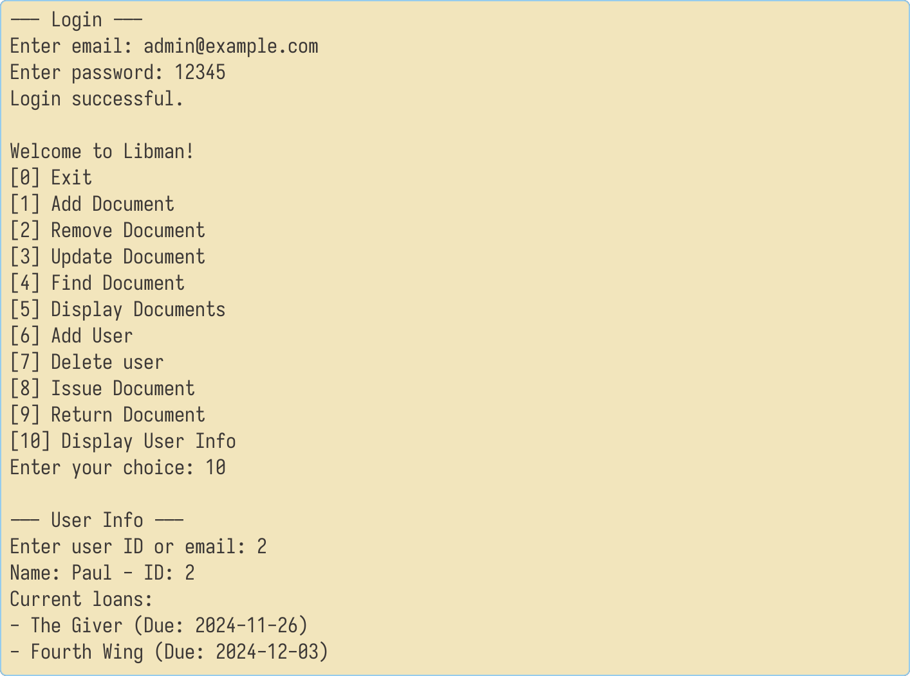
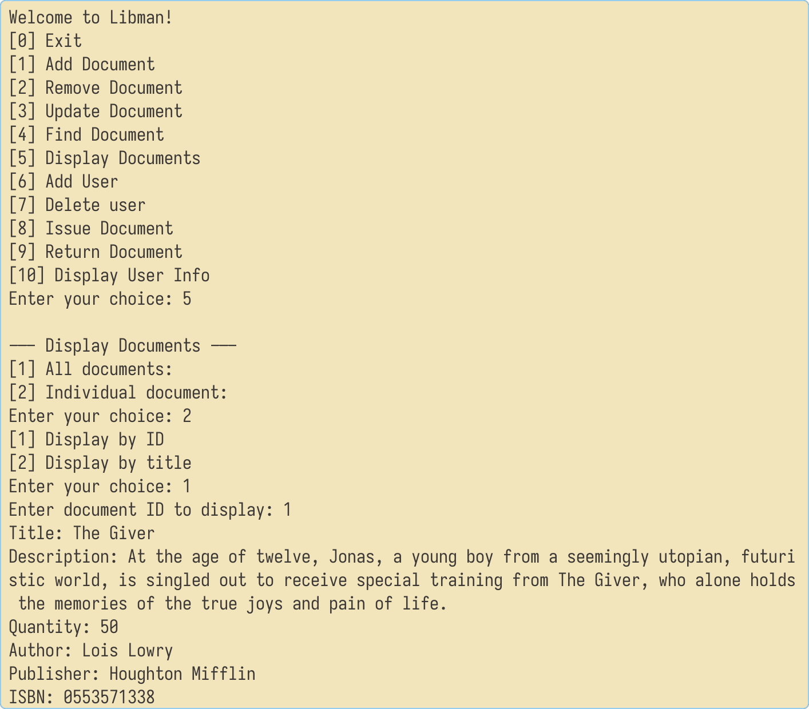

<h1 align="center">
  Libman
</h1>
<h4 align="center">A library management app built with JavaFX</h4>
<p align="center">
  <a href="#key-features">Key Features</a> •
  <a href="#how-to-use">How To Use</a> •
  <a href="#showcase">Showcase</a> •
  <a href="#credits">Credits</a> •
  <a href="#license">License</a>
</p>


## Key Features

* CLI interface for basic operations
* Fully functional GUI for managing materials, loans, and users
* User authentication and authorization
* Allow non-librarian users to borrow and return materials
* Nice statistics dashboard for librarians

## How To Use

First, you need to set up the database. You can find the database scheme and optionally the sample database
in `resources/db` folder.
Should you import the sample database, you can use the following credentials:

```
Admin account
Username: admin@example.com
Password: 12345

User account
Username: user@example.com
Password: 12345
```

After setting up the database, copy the `example.env` file to `.env` and change the values to match your database
configuration.

To run the console application, you can use the following command:

```bash
mvn clean compile exec:java
```

Alternatively, you can run the GUI application using the following command:

```bash
mvn clean compile javafx:run
```

## Showcase

| <div align="center"><br>[Users management](https://github.com/thangisme/Libman/blob/master/Screenshot/preview3.png)</div>           | <div align="center"><br>[Loans management](https://github.com/thangisme/Libman/blob/master/Screenshot/preview4.png)</div>                   |
|----------------------------------------------------------------------------------------------------------------------------------------------------------------------------------------|------------------------------------------------------------------------------------------------------------------------------------------------------------------------------------------------|
| <div align="center"><br>[User homepage](https://github.com/thangisme/Libman/blob/master/Screenshot/preview8.png)</div>                 | <div align="center"><br>[User loans](https://github.com/thangisme/Libman/blob/master/Screenshot/preview5.png)</div>                               |
| <div align="center"><br>[User homepage section](https://github.com/thangisme/Libman/blob/master/Screenshot/preview9.png)</div> | <div align="center"><br>[User material searching](https://github.com/thangisme/Libman/blob/master/Screenshot/preview10.png)</div>  |
| <div align="center"><br>[CLI show user details](https://github.com/thangisme/Libman/blob/master/Screenshot/preview6.png)</div> | <div align="center"><br>[CLI show material details](https://github.com/thangisme/Libman/blob/master/Screenshot/preview7.png)</div> |

## Credits

This software uses the following open source packages:

- [JavaFX](https://openjfx.io/)
- [AtlantaFX](https://mkpaz.github.io/atlantafx/) - An excellent JavaFX theme with great documentation.
- [Ikonli](https://kordamp.org/ikonli/)
- [Feather Icons](https://feathericons.com)
- [Saravanan](https://dribbble.com/shots/20950405--Library-Management-System) - For the design inspiration

## License

MIT